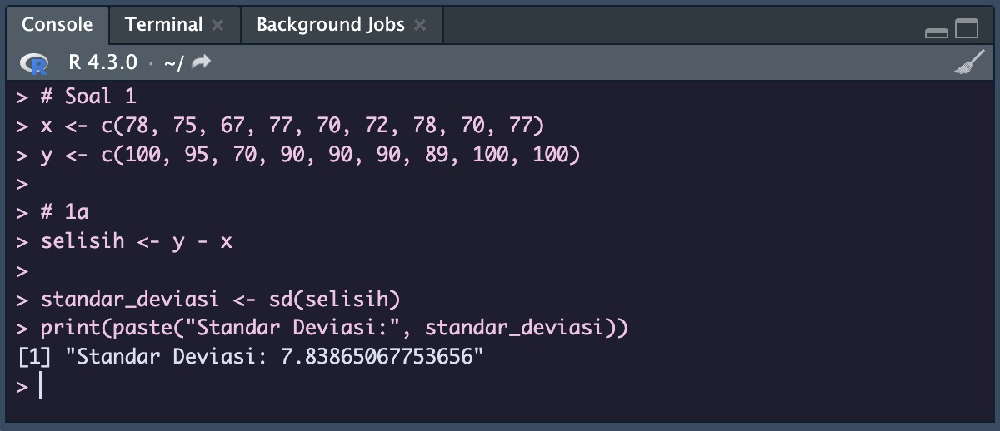
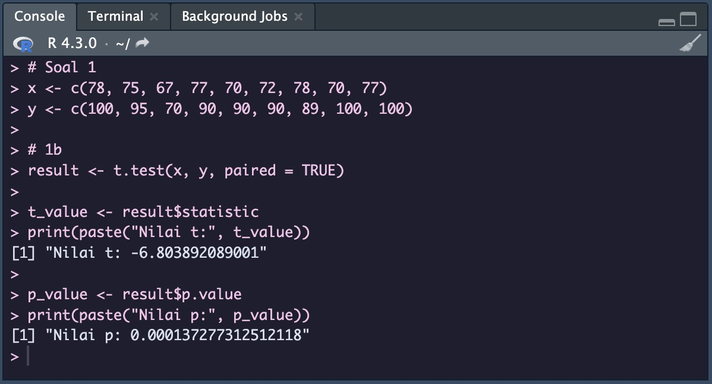
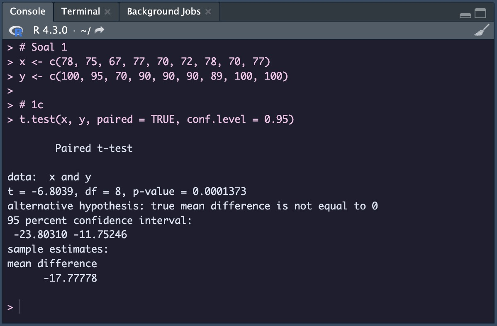
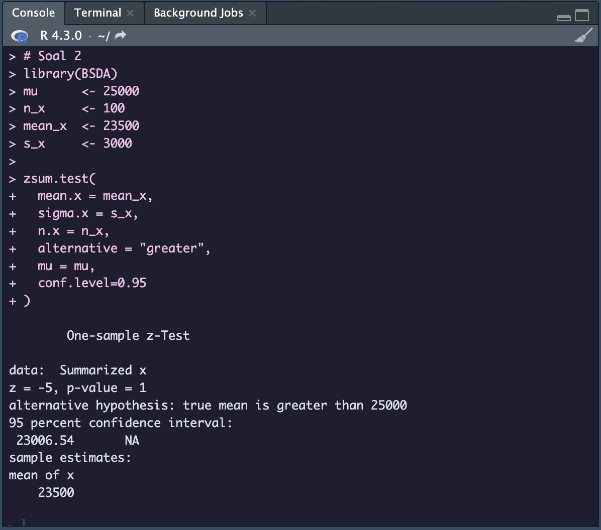
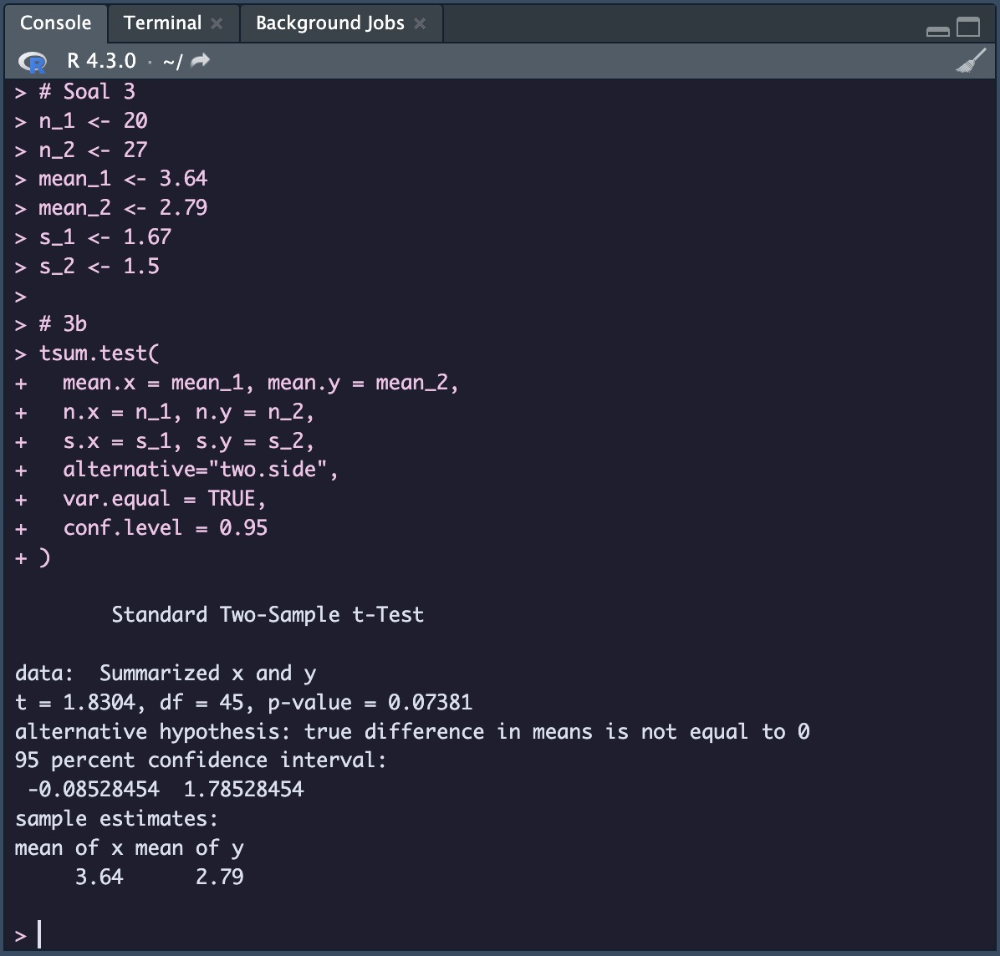
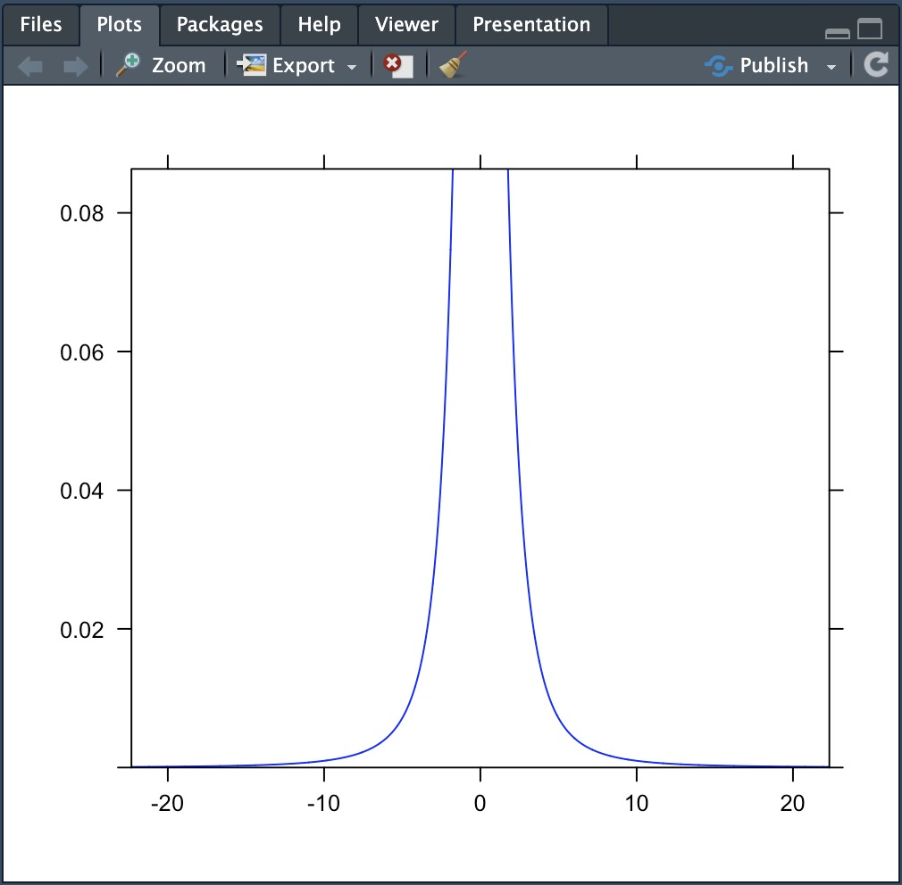
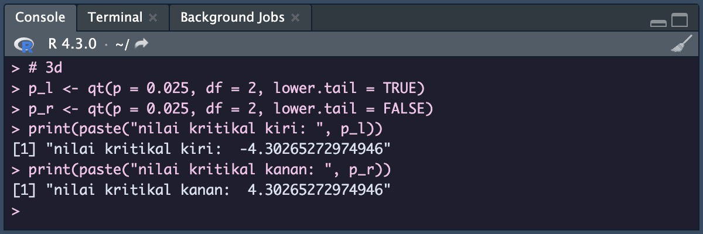
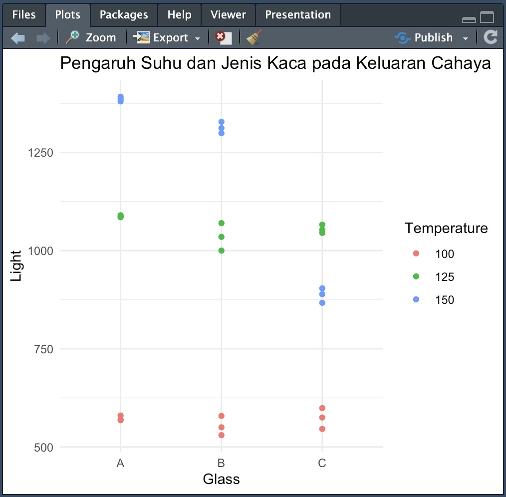
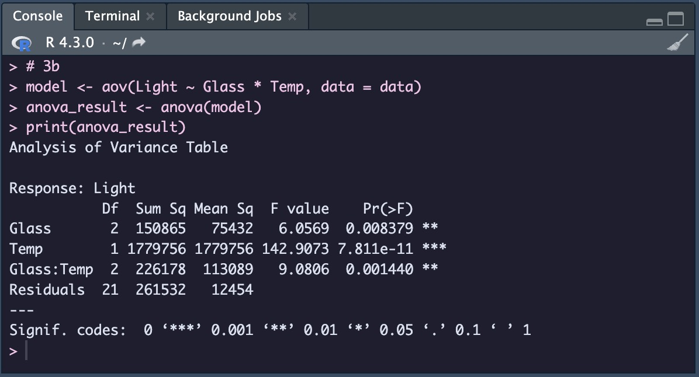
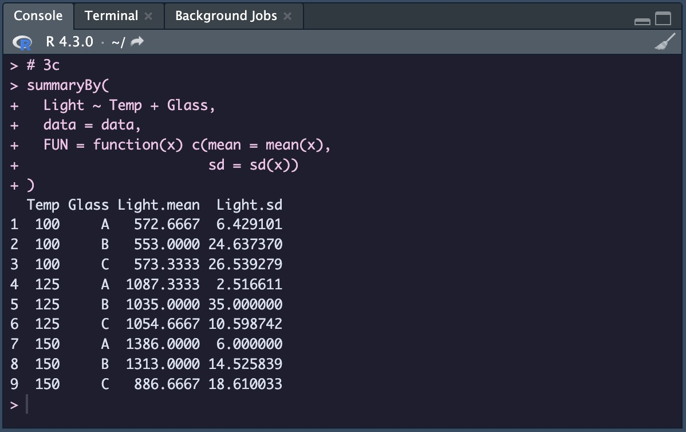

<div align=center>

# **Praktikum Modul 2 Probabilitas dan Statistik**

| Nama | Irsyad Fikriansyah Ramadhan |
|:-----|:----------------------------|
| NRP  | 5025211149                  |

</div>
<br/>
<div align=justify>

### **Soal 1**

Seorang peneliti melakukan penelitian mengenai pengaruh aktivitas $A$ terhadap kadar saturasi oksigen pada manusia. Peneliti tersebut mengambil sampel sebanyak 9 responden. Pertama, sebelum melakukan aktivitas $A$, peneliti mencatat kadar saturasi oksigen dari 9 responden tersebut. Kemudian, 9 responden tersebut diminta melakukan aktivitas $A$. Setelah 15 menit, peneliti tersebut mencatat kembali kadar saturasi oksigen dari 9 responden tersebut. Berikut data dari responden mengenai kadar saturasi oksigen sebelum dan sesudah melakukan aktivitas $A$.

<div align=center>

| Responden | X   | Y   |
|:---------:|:---:|:---:|
| 1         | 78  | 100 |
| 2         | 75  | 95  |
| 3         | 67  | 70  |
| 4         | 77  | 90  |
| 5         | 70  | 90  |
| 6         | 72  | 90  |
| 7         | 78  | 89  |
| 8         | 70  | 100 |
| 9         | 77  | 100 |

</div>

Berdasarkan data pada tabel diatas, diketahui kadar saturasi oksigen dari responden ke-3 ketika belum melakukan aktivitas 𝐴 sebanyak 67, dan setelah melakukan aktivitas 𝐴 sebanyak 70.

<ol type="a">
<li>

Carilah Standar deviasi dari data selisih pasangan pengamatan tabel diatas!

</li>

```R
x <- c(78, 75, 67, 77, 70, 72, 78, 70, 77)
y <- c(100, 95, 70, 90, 90, 90, 89, 100, 100)
selisih <- y - x 

standar_deviasi <- sd(selisih)
print(paste("Standar Deviasi:", standar_deviasi))
```



> Standar deviasi dari data selisih pasangan pengamatan tersebut adalah $\sigma=7.83865067753656$.

<li>
Carilah nilai t (p-value)!
</li>

```R
result <- t.test(x, y, paired = TRUE)

t_value <- result$statistic
print(paste("Nilai t:", t_value))

p_value <- result$p.value
print(paste("Nilai p:", p_value))
```



> Didapatkan nilai $t = -6.803892089001$ dan $p\text{-value} = 0.000137277312512118$.

<li>
Tentukanlah apakah terdapat pengaruh yang signifikan secara statistika dalam hal kadar saturasi oksigen, sebelum dan sesudah melakukan aktivitas 𝐴 jika diketahui tingkat signifikansi 𝛼 = 5% serta H0 : “tidak ada pengaruh yang signifikan secara statistika dalam hal kadar saturasi oksigen sebelum dan sesudah melakukan aktivitas 𝐴”!
</li>

```R
t.test(x, y, paired = TRUE, conf.level = 0.95)

# alternative hypothesis: true mean difference is not equal to 0
```



> Kesimpulannya adalah tolak $H_0: \mu_x = \mu_y$.

</ol>

<!-- !spacer !spacer !spacer !spacer !spacer !spacer !spacer !spacer !spacer -->

## **SOAL 2**

Diketahui bahwa mobil dikemudikan rata-rata lebih dari 25.000 kilometer per tahun. Untuk menguji klaim ini, 100 pemilik mobil yang dipilih secara acak diminta untuk mencatat jarak yang mereka tempuh. Jika sampel acak menunjukkan rata-rata 23.500 kilometer dan standar deviasi 3.000 kilometer (kerjakan menggunakan library seperti referensi pada modul).

<ol type="a">
<li>
Apakah Anda setuju dengan klaim tersebut? Jelaskan!
</li>

$H_0: \mu \le 25000$

$H_1: \mu > 25000$

```R
library(BSDA)
mu      <- 25000
n_x     <- 100
mean_x  <- 23500
s_x     <- 3000

zsum.test(
    mean.x = mean_x, 
    sigma.x = s_x, 
    n.x = n_x,
    alternative = "greater", 
    mu = mu, 
    conf.level=0.95
)

# alternative hypotesis: true mean is greater than 25000
```



> Tidak setuju

<li>
Buatlah kesimpulan berdasarkan p-value yang dihasilkan!
</li>

> Nilai $p\text{-value}$ yang dihasilkan lebih dari significance level $(1 > 0.05)$, sehingga dapat disimpulkan terima $H_0$, yang menyatakan bahwa mobil dikemudikan rata-rata kurang dari atau sama dengan $25000$ kilometer per tahun.

</ol>

<!-- !spacer !spacer !spacer !spacer !spacer !spacer !spacer !spacer !spacer -->

## **SOAL 3**

Diketahui perusahaan memiliki seorang data analyst yang ingin memecahkan
permasalahan pengambilan keputusan dalam perusahaan tersebut. Selanjutnya didapatkanlah data berikut dari perusahaan saham tersebut.

<div align="center">

| Nama Kota/Atribut      | Bandung | Bali |
|:----------------------:|:-------:|:----:|
| Jumlah Saham           | 20      | 27   |
| Sampel Mean            | 3.64    | 2.79 |
| Sampel Standar Deviasi | 1.67    | 1.5  |

</div>

Dari data di atas berilah keputusan serta kesimpulan yang didapatkan. Asumsikan nilai variancenya sama, apakah ada perbedaan pada rata-ratanya ($\alpha = 0.05$)? Buatlah:

<ol type="a">

<li>

$H_0$ dan $H_1$

</li>

$H_0:\mu_1=\mu_2$

$H_1:\mu_1\ne\mu_2$

> $H_0:$ Tidak terdapat perbedaan antara rerata saham Kota Bandung $(\mu_1)$ dengan rerata saham Kota Bali $(\mu_2)$.

> $H_1:$ Terdapat perbedaan antara rerata saham Kota Bandung $(\mu_1)$ dengan rerata saham Kota Bali $(\mu_2)$.

<li>
Hitung sampel statistik
</li>

```R
n_1 <- 20
n_2 <- 27
mean_1 <- 3.64
mean_2 <- 2.79
s_1 <- 1.67
s_2 <- 1.5

tsum.test(
    mean.x = mean_1, mean.y = mean_2, 
    n.x = n_1, n.y = n_2, 
    s.x = s_1, s.y = s_2,
    alternative="two.side",
    var.equal = TRUE, 
    conf.level = 0.95
)
```



> $t = 1.8304$ <br> $p\text{-value} = 0.07381$

<li>
Lakukan uji statistik (df =2)
</li>

```R
library(mosaic)
plotDist(dist = 't', df = 2, col = "blue")
```



<li>
Nilai kritikal
</li>

```R
p_l <- qt(p = 0.025, df = 2, lower.tail = TRUE)
p_r <- qt(p = 0.025, df = 2, lower.tail = FALSE)
print(paste("nilai kritikal kiri: ", p_l)) 
print(paste("nilai kritikal kanan: ", p_r))
```



> Nilai kritikal kiri: -4.30265272974946 <br> Nilai kritikal kanan: 4.30265272974946

<li>
Keputusan
</li>

> Nilai $t$ berada pada rentang nilai kritikal dan $p\text{-value}$ lebih dari significance level $(p\text{-value} > \alpha)$, maka gagal menolak $H_0$.

<li>
Kesimpulan
</li>

> Kesimpulan yang dapat diambil adalah bahwa berdasarkan data yang tersedia dan dengan tingkat signifikansi $\alpha = 0.05$, tidak terdapat cukup bukti statistik untuk mendukung adanya perbedaan yang signifikan antara rata-rata jumlah saham di Bandung dan Bali.

</ol>
<!-- !spacer !spacer !spacer !spacer !spacer !spacer !spacer !spacer !spacer -->

## **SOAL 4**

Data yang digunakan merupakan hasil eksperimen yang dilakukan untuk mengetahui pengaruh suhu operasi (100 ̊C, 125˚C. dan 150 ̊C) dan tiga jenis kaca pelat muka (A, B, dan C) pada keluaran cahaya tabung osiloskop. Percobaan dilakukan sebanyak 27 kali dan didapat data sebagai berikut:

<div align="center">

<https://drive.google.com/file/d/1pICtCrf61DRU86LDPQDJmcKiUMVt9ht4/view>

</div>

Dengan data tersebut:

<ol type="a">
<li>
Buatlah plot sederhana untuk visualisasi data.
</li>

```R
data <- read.csv("GTI.csv")

library(ggplot2)
ggplot(data, aes(x = Glass, y = Light, color = factor(Temp))) +
  geom_point() +
  labs(x = "Glass", y = "Light", color = "Temperature") +
  ggtitle("Pengaruh Suhu dan Jenis Kaca pada Keluaran Cahaya") +
  theme_minimal()
```



<li>
Lakukan uji ANOVA dua arah.
</li>

```R
model <- aov(Light ~ Glass * Temp, data = data)
anova_result <- anova(model)
print(anova_result)
```


<li>
Tampilkan tabel dengan mean dan standar deviasi keluaran cahaya untuk setiap perlakuan (kombinasi kaca pelat muka dan suhu operasi).
</li>

```R
summaryBy(
	Light ~ Temp + Glass, 
	data = data, 
	FUN = function(x) c(mean = mean(x), 
	sd = sd(x))
)
```



</ol>
</div>
